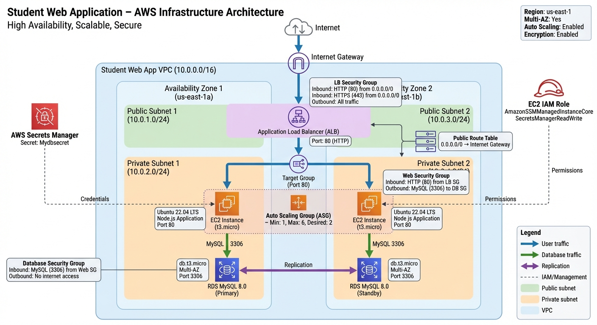

# Student Web Application - AWS Infrastructure

A production-ready, scalable AWS infrastructure for a student records web application built with Terraform. This project provisions a complete infrastructure including VPC, Application Load Balancer, Auto Scaling Group, RDS MySQL database, and all necessary networking and security components.

## 📋 Table of Contents

- [Overview](#overview)
- [Architecture](#architecture)
- [Features](#features)
- [Prerequisites](#prerequisites)
- [Installation](#installation)
- [Configuration](#configuration)
- [Usage](#usage)
- [Variables](#variables)
- [Outputs](#outputs)
- [Infrastructure Components](#infrastructure-components)
- [File Structure](#file-structure)
- [Cleanup](#cleanup)
- [Troubleshooting](#troubleshooting)
- [Best Practices](#best-practices)

## 🎯 Overview

This Terraform project creates a complete, production-ready AWS infrastructure with:

- **VPC**: Custom Virtual Private Cloud with public and private subnets across multiple availability zones
- **Application Load Balancer (ALB)**: Distributes traffic across multiple EC2 instances
- **Auto Scaling Group (ASG)**: Automatically scales EC2 instances based on CPU utilization
- **EC2 Instances**: Web servers running in private subnets for security
- **RDS MySQL Database**: Multi-AZ MySQL 8.0 database for high availability
- **Security Groups**: Network-level security rules for all components
- **IAM Roles**: Secure access to AWS services (Secrets Manager, SSM)
- **AWS Secrets Manager**: Secure storage of database credentials
- **Key Pair Management**: Automated SSH key generation and management

## 🏗️ Architecture

<!-- include image instead -->



### Architecture Highlights

- **High Availability**: Resources distributed across multiple availability zones
- **Security**: Web servers in private subnets, database not publicly accessible
- **Scalability**: Auto Scaling Group automatically adjusts capacity based on demand
- **Load Distribution**: Application Load Balancer distributes traffic evenly
- **Secure Credentials**: Database credentials stored in AWS Secrets Manager

## ✨ Features

- ✅ **Multi-AZ Deployment**: High availability across multiple availability zones
- ✅ **Auto Scaling**: Automatic scaling based on CPU utilization
- ✅ **Load Balancing**: Application Load Balancer for traffic distribution
- ✅ **Security**: Private subnets, security groups, and IAM roles
- ✅ **Database**: Multi-AZ RDS MySQL with automated backups
- ✅ **Secrets Management**: AWS Secrets Manager for secure credential storage
- ✅ **Infrastructure as Code**: Fully automated infrastructure provisioning
- ✅ **Tagging**: Consistent resource tagging for cost tracking and management

## 📦 Prerequisites

### 1. AWS Account Setup

**You must create an AWS IAM user with appropriate permissions before using this Terraform project.**

#### Steps to Create AWS User:

1. **Log in to AWS Console** and navigate to **IAM (Identity and Access Management)**

2. **Create a new IAM User:**

   - Go to **Users** → **Create user**
   - Enter a username (e.g., `terraform-user`)
   - Select **Access key - Programmatic access** (required for Terraform)
   - Click **Next**

3. **Attach Permissions:**

   - Select **Attach policies directly**
   - Attach the following policies:
     - **AmazonEC2FullAccess** - For EC2, VPC, and networking resources
     - **AmazonRDSFullAccess** - For RDS database management
     - **IAMFullAccess** - For IAM roles and policies
     - **SecretsManagerReadWrite** - For secrets management
     - **AmazonSSMFullAccess** - For Systems Manager access
   - Click **Next** → **Create user**

4. **Save Access Credentials:**
   - ⚠️ **Important**: Download or copy the **Access Key ID** and **Secret Access Key**
   - Store these securely - you won't be able to view the secret key again

#### Alternative: Custom Policy (More Secure)

For better security, create a custom policy with only the required permissions:

```json
{
  "Version": "2012-10-17",
  "Statement": [
    {
      "Effect": "Allow",
      "Action": [
        "ec2:*",
        "rds:*",
        "vpc:*",
        "iam:CreateRole",
        "iam:AttachRolePolicy",
        "iam:CreateInstanceProfile",
        "iam:AddRoleToInstanceProfile",
        "iam:PassRole",
        "secretsmanager:*",
        "ssm:*",
        "elasticloadbalancing:*",
        "autoscaling:*"
      ],
      "Resource": "*"
    }
  ]
}
```

### 2. Required Software

- **Terraform** (>= 1.5.0)

  ```bash
  terraform version
  ```

- **AWS CLI** (for verification)
  ```bash
  aws --version
  ```

### 3. AWS CLI Configuration

Configure AWS CLI with your credentials:

```bash
aws configure
```

When prompted, enter:

- **AWS Access Key ID**: Your access key
- **AWS Secret Access Key**: Your secret key
- **Default region**: e.g., `us-east-1`
- **Default output format**: `json`

### 4. Verify AWS Credentials

```bash
aws sts get-caller-identity
```

This should return your user ARN and account information.

## 🚀 Installation

1. **Clone or navigate to the project directory:**

   ```bash
   cd terraform
   ```

2. **Initialize Terraform:**

   ```bash
   terraform init
   ```

   This will download the required provider plugins (AWS, TLS, Local).

## ⚙️ Configuration

### Default Configuration

The project comes with sensible defaults defined in `variables.tf`:

| Component            | Default Value                            |
| -------------------- | ---------------------------------------- |
| AWS Region           | `us-east-1`                              |
| VPC CIDR             | `10.0.0.0/16`                            |
| Public Subnets       | `10.0.1.0/24`, `10.0.2.0/24`             |
| Private Subnets      | `10.0.101.0/24`, `10.0.102.0/24`         |
| Database Name        | `STUDENTS`                               |
| Database Username    | `nodeapp`                                |
| Database Password    | `student12` ⚠️ **Change in production!** |
| Instance Type        | `t3.micro`                               |
| ASG Min Size         | `1`                                      |
| ASG Max Size         | `5`                                      |
| ASG Desired Capacity | `2`                                      |
| RDS Instance Class   | `db.t3.micro`                            |
| RDS Multi-AZ         | `true`                                   |

### Customizing Configuration

#### Option 1: Create `terraform.tfvars` (Recommended)

Create a `terraform.tfvars` file in the project root:

```hcl
aws_region = "us-west-2"
vpc_cidr   = "10.0.0.0/16"

public_subnets  = ["10.0.1.0/24", "10.0.2.0/24"]
private_subnets = ["10.0.101.0/24", "10.0.102.0/24"]

db_name     = "STUDENTS"
db_username = "nodeapp"
db_password = "your-secure-password-here"

instance_type = "t3.micro"
key_name      = "webapp-key"

# Auto Scaling Configuration
asg_min_size            = 2
asg_max_size            = 10
asg_desired_capacity    = 3
asg_target_cpu_utilization = 70.0

# RDS Configuration
rds_allocated_storage = 50
rds_instance_class    = "db.t3.small"
rds_multi_az         = true
```

#### Option 2: Command-Line Variables

```bash
terraform apply \
  -var="db_password=my-secure-password" \
  -var="aws_region=us-west-2" \
  -var="asg_max_size=10"
```

#### Option 3: Environment Variables

```bash
export TF_VAR_db_password="my-secure-password"
export TF_VAR_aws_region="us-west-2"
terraform apply
```

## 📖 Usage

### Step 1: Review the Execution Plan

Always review what Terraform will create before applying:

```bash
terraform plan
```

This shows:

- Resources that will be created
- Resources that will be modified
- Resources that will be destroyed

### Step 2: Apply the Configuration

If the plan looks correct, apply it:

```bash
terraform apply
```

Terraform will prompt for confirmation. Type `yes` to proceed.

**⏱️ Deployment Time**: The infrastructure typically takes 10-15 minutes to deploy, primarily due to RDS Multi-AZ setup.

**💰 Cost Note**: This creates AWS resources that incur costs. RDS Multi-AZ doubles the database cost.

### Step 3: Access the Application

After deployment, get the application URL:

```bash
terraform output application_url
```

Or view all outputs:

```bash
terraform output
```

The application will be available at: `http://<alb-dns-name>`

### Step 4: Verify Infrastructure

Verify resources were created:

```bash
# Check VPC
aws ec2 describe-vpcs --filters "Name=tag:Name,Values=student-vpc"

# Check Load Balancer
aws elbv2 describe-load-balancers --names student-alb

# Check Auto Scaling Group
aws autoscaling describe-auto-scaling-groups --auto-scaling-group-names student-asg

# Check RDS Instance
aws rds describe-db-instances --db-instance-identifier student-database
```

## 📝 Variables

| Variable                     | Description                | Type           | Default                              | Required |
| ---------------------------- | -------------------------- | -------------- | ------------------------------------ | -------- |
| `aws_region`                 | AWS region for resources   | `string`       | `us-east-1`                          | No       |
| `vpc_cidr`                   | CIDR block for VPC         | `string`       | `10.0.0.0/16`                        | No       |
| `public_subnets`             | Public subnet CIDR blocks  | `list(string)` | `["10.0.1.0/24", "10.0.2.0/24"]`     | No       |
| `private_subnets`            | Private subnet CIDR blocks | `list(string)` | `["10.0.101.0/24", "10.0.102.0/24"]` | No       |
| `db_name`                    | MySQL database name        | `string`       | `STUDENTS`                           | No       |
| `db_username`                | RDS master username        | `string`       | `nodeapp`                            | No       |
| `db_password`                | RDS master password        | `string`       | `student12`                          | No       |
| `instance_type`              | EC2 instance type          | `string`       | `t3.micro`                           | No       |
| `key_name`                   | EC2 Key Pair name          | `string`       | `webapp-key`                         | No       |
| `asg_min_size`               | ASG minimum instances      | `number`       | `1`                                  | No       |
| `asg_max_size`               | ASG maximum instances      | `number`       | `5`                                  | No       |
| `asg_desired_capacity`       | ASG desired instances      | `number`       | `2`                                  | No       |
| `asg_target_cpu_utilization` | Target CPU % for scaling   | `number`       | `80.0`                               | No       |
| `rds_allocated_storage`      | RDS storage in GB          | `number`       | `20`                                 | No       |
| `rds_instance_class`         | RDS instance class         | `string`       | `db.t3.micro`                        | No       |
| `rds_multi_az`               | Enable RDS Multi-AZ        | `bool`         | `true`                               | No       |

## 📤 Outputs

After deployment, Terraform provides the following outputs:

| Output            | Description                        |
| ----------------- | ---------------------------------- |
| `vpc_id`          | VPC ID                             |
| `alb_dns_name`    | Application Load Balancer DNS name |
| `application_url` | Full application URL (HTTP)        |
| `rds_endpoint`    | RDS MySQL endpoint                 |
| `asg_name`        | Auto Scaling Group name            |
| `db_secret_arn`   | Secrets Manager secret ARN         |

View all outputs:

```bash
terraform output
```

Get specific output:

```bash
terraform output application_url
terraform output alb_dns_name
terraform output rds_endpoint
```

## 🏛️ Infrastructure Components

### Network (`network/`)

**VPC (`network/vpc.tf`)**:

- **VPC**: Main VPC with DNS support enabled
- **Public Subnets**: Two subnets across different AZs for Load Balancer
- **Private Subnets**: Two subnets across different AZs for EC2 and RDS
- **Internet Gateway**: Enables internet access for public subnets
- **Route Tables**: Routes traffic for public subnets

**Security Groups (`network/security.tf`)**:

- **Load Balancer SG**: Allows HTTP/HTTPS from internet
- **Web Server SG**: Allows HTTP from Load Balancer only
- **Database SG**: Allows MySQL from web servers only

### Compute (`compute/`)

**EC2 (`compute/ec2.tf`)**:

- **Bootstrap Instance**: Initial EC2 instance for application setup
- **User Data**: Automated installation and configuration script
- **AMI Creation**: Creates custom AMI for Auto Scaling Group

**Auto Scaling Group (`compute/asg.tf`)**:

- **Launch Template**: Defines EC2 instance configuration
- **Auto Scaling Group**: Maintains desired number of instances
- **Scaling Policy**: CPU-based auto scaling (target: 80% CPU)
- **AMI**: Custom AMI created from bootstrap instance

**Key Pair (`compute/keypair.tf`)**:

- **Key Generation**: Automatically generates SSH key pair
- **AWS Key Pair**: Creates AWS key pair resource
- **Local File**: Saves private key locally (with secure permissions)

### Database (`database/`)

**RDS (`database/rds.tf`)**:

- **MySQL 8.0**: Multi-AZ RDS MySQL database
- **Subnet Group**: Deployed in private subnets
- **Backups**: Automated daily backups (7-day retention)
- **Encryption**: Storage encryption enabled

### Load Balancer (`load-balancer/`)

**Application Load Balancer (`load-balancer/alb.tf`)**:

- **ALB**: Application Load Balancer in public subnets
- **Target Group**: Routes traffic to EC2 instances on port 80
- **HTTP Listener**: Listens on port 80 and forwards to target group
- **Health Checks**: Monitors instance health via HTTP requests

### IAM (`iam/`)

**IAM Roles (`iam/role.tf`)**:

- **EC2 Role**: IAM role for EC2 instances
- **SSM Access**: Systems Manager for secure access
- **Secrets Manager**: Read database credentials

### Secrets (`secrets/`)

**Secrets Manager (`secrets/secrets.tf`)**:

- **Database Secret**: Stores RDS credentials securely
- **Secret Version**: Contains username, password, host, and database name

### Shared Configuration (`shared/`)

**Shared Files (`shared/`)**:

- **`locals.tf`**: Common values and tags used across all resources
- **`variables.tf`**: Input variables for the entire infrastructure
- **`outputs.tf`**: Output values for important resource information
- **`versions.tf`**: Terraform and provider version constraints

## 📁 File Structure

The project is organized into logical folders for better maintainability:

```
terraform/
├── network/                    # Networking resources
│   ├── vpc.tf                 # VPC, subnets, Internet Gateway, Route Tables
│   └── security.tf            # Security Groups
├── compute/                    # Compute resources
│   ├── ec2.tf                 # EC2 bootstrap instance
│   ├── asg.tf                 # Auto Scaling Group and Launch Template
│   └── keypair.tf             # SSH key pair generation
├── database/                   # Database resources
│   └── rds.tf                 # RDS MySQL database
├── load-balancer/              # Load balancing resources
│   └── alb.tf                 # Application Load Balancer configuration
├── iam/                        # Identity and Access Management
│   └── role.tf                # IAM roles and policies
├── secrets/                    # Secrets management
│   └── secrets.tf             # AWS Secrets Manager
├── shared/                     # Shared configuration files
│   ├── locals.tf              # Common values and tags
│   ├── variables.tf           # Input variables
│   ├── outputs.tf             # Output values
│   └── versions.tf            # Terraform and provider versions
├── main.tf                     # Root configuration entry point
├── .gitignore                  # Git ignore rules
└── README.md                   # This file
```

**Note**: Terraform automatically reads all `.tf` files recursively from subdirectories, so this organization works seamlessly without any additional configuration.

## 🧹 Cleanup

To destroy all resources and avoid ongoing charges:

```bash
terraform destroy
```

Terraform will show what will be destroyed and ask for confirmation. Type `yes` to proceed.

**⚠️ Warning**: This will permanently delete:

- RDS database and all data
- All EC2 instances and AMIs
- Load Balancer and Target Groups
- Auto Scaling Group
- All networking components
- Security groups
- IAM roles and instance profiles

**💾 Backup**: Ensure you have backups before destroying if needed!

## 🔧 Troubleshooting

### Error: "Reference to undeclared resource"

**Solution**: Ensure all `.tf` files are in the same directory and run:

```bash
terraform init
```

### Error: "InvalidParameterValue: The parameter identifier is already in use"

**Solution**: The RDS identifier already exists. Either:

- Change the identifier in `rds.tf` (update `identifier` field)
- Delete the existing RDS instance
- Use a different AWS region

### Error: "InvalidKeyPair.NotFound"

**Solution**: The key pair is automatically created by Terraform. If this error occurs:

- Check that the `tls` provider is properly initialized
- Verify IAM permissions include `ec2:CreateKeyPair`

### Application Not Accessible

**Checklist**:

1. Verify ALB is in "active" state: `aws elbv2 describe-load-balancers`
2. Check target group health: `aws elbv2 describe-target-health --target-group-arn <arn>`
3. Verify security groups allow traffic
4. Check EC2 instances are running: `aws ec2 describe-instances`
5. Review application logs on EC2 instances

### Database Connection Issues

**Checklist**:

1. Verify RDS instance is in "available" status
2. Check security group allows MySQL (port 3306) from web servers
3. Verify database credentials in Secrets Manager
4. Test connection from EC2 instance:
   ```bash
   mysql -h <rds-endpoint> -u <username> -p
   ```

### Auto Scaling Not Working

**Checklist**:

1. Verify CloudWatch metrics are being collected
2. Check ASG activity: `aws autoscaling describe-scaling-activities --auto-scaling-group-name student-asg`
3. Verify scaling policy is attached
4. Check instance health in target group

## 💡 Best Practices

### Security

- ✅ Change default database password before production
- ✅ Enable deletion protection for RDS in production
- ✅ Use AWS Secrets Manager for all sensitive data
- ✅ Restrict security group rules to minimum required access
- ✅ Enable VPC Flow Logs for network monitoring
- ✅ Use HTTPS/SSL certificates for production (add ACM certificate)

### Cost Optimization

- ⚠️ RDS Multi-AZ doubles cost - disable for development (`rds_multi_az = false`)
- ⚠️ Use smaller instance types for development
- ⚠️ Set lower ASG desired capacity for development
- ⚠️ Always run `terraform destroy` when not using infrastructure
- 💡 Use AWS Cost Explorer to monitor spending

### Monitoring

- Add CloudWatch alarms for critical metrics
- Enable detailed monitoring for EC2 instances
- Set up RDS performance insights
- Configure ALB access logs

### Backup & Recovery

- Enable automated RDS backups (already configured)
- Consider snapshot strategy for AMIs
- Document recovery procedures
- Test backup restoration regularly

## 📚 Additional Resources

- [Terraform AWS Provider Documentation](https://registry.terraform.io/providers/hashicorp/aws/latest/docs)
- [AWS VPC Documentation](https://docs.aws.amazon.com/vpc/)
- [AWS RDS Documentation](https://docs.aws.amazon.com/rds/)
- [AWS Application Load Balancer](https://docs.aws.amazon.com/elasticloadbalancing/latest/application/)
- [AWS Auto Scaling](https://docs.aws.amazon.com/autoscaling/)
- [AWS Secrets Manager](https://docs.aws.amazon.com/secretsmanager/)

## 📄 License

This project is provided as-is for educational and production purposes.

## 🤝 Contributing

Contributions are welcome! Please feel free to submit issues or pull requests for improvements.

---

**⚠️ Important**: Remember to change default passwords and review all security settings before deploying to production!

**📧 Support**: For issues or questions, please open an issue in the repository.
